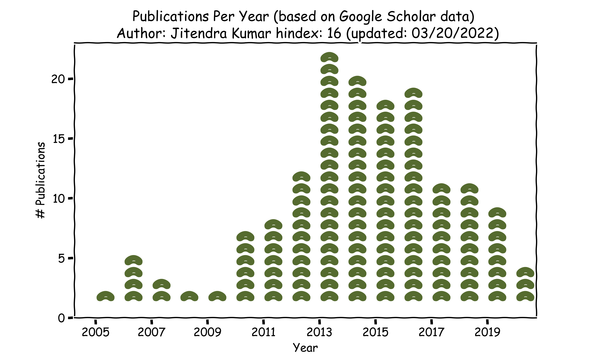
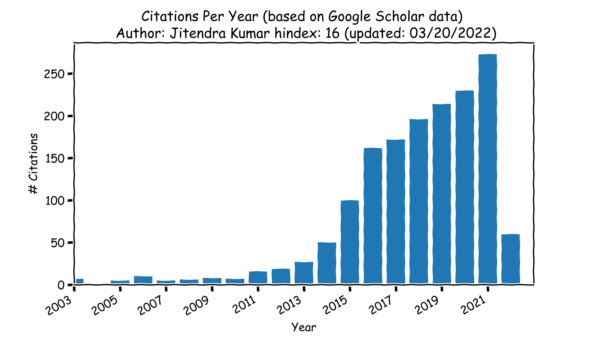

# Academic Bean Counter aka publication metrics

Assembling publication metrics (a.k.a. counting the beans) is the annual ritual for anyone in research and academia. This script allows pulling the publication statistics from Google Scholar and plot time series of publications per year and citations per year.

And as added value, it appropriately plots the annual publication counts as pile of beans.

Pre-requisites you will need in your Python environment: 
-`matplotlib` 
- `pandas` 
- `svgpath2mpl` 
- `pybtex` 
- `scholarly`

Usage: `python plot_publication_timeseries.py --authorid HL9KDdYAAAAJ --gscitations --gspubs`

Publications per year: `python plot_publication_timeseries.py --authorid HL9KDdYAAAAJ --gspubs`

Citations per year: `python plot_publication_timeseries.py --authorid HL9KDdYAAAAJ --gscitations`

